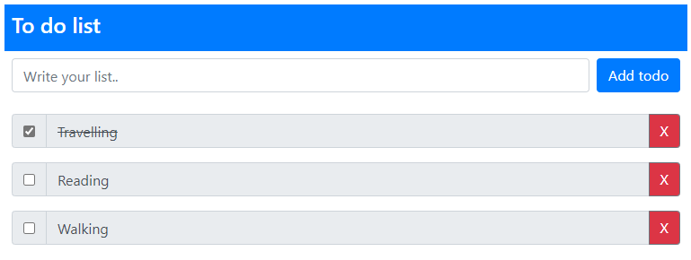

# JS to-do-list

- [Text Input Field](#text-input-field)
- [Add New Button](#add-new-button)
- [Checkbox](#checkbox)
- [Delete Button](#done-button)

## Text Input Field

This is the text field to fill your list.

## Add New Button

The button is to add new list and store to localstorage.

## Checkbox 

The checkbox is to check when list is done or uncheck when list is not finish.

## Delete Button

This button is to delete the list.
